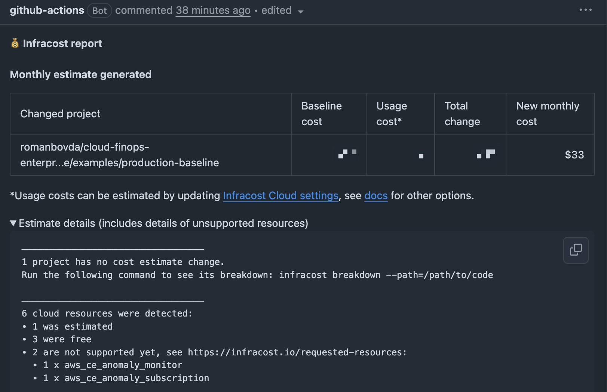
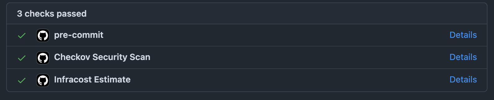

# Enterprise Cloud FinOps & Governance Consulting Baseline

An enterprise-grade **Cloud FinOps and SRE Baseline** engineered to enforce rigorous financial controls, architectural standards, and proactive anomaly detection across scale-out AWS environments. 

This repository serves as our foundational reference architecture for organizations seeking to operationalize Shift-Left FinOps and DevSecOps within their Infrastructure as Code (IaC) pipelines. It underpins our professional consulting methodologies.

## Strategic Value for Executives & Engineering Leaders

In highly distributed cloud infrastructures, unpredictable operational costs and compliance drift represent material business risks. This baseline framework programmatically mitigates these challenges:

- **Cost Predictability & Shift-Left FinOps**: By natively integrating `infracost` into the CI/CD pipeline, the financial impact of architectural changes is calculated and reviewed during the Pull Request phase *before* infrastructure is provisioned. Engineering teams gain immediate visibility into the price tag of their designs.

  
- **Automated Governance & Guardrails**: Prevents unauthorized architectural sprawl by hard-blocking the deployment of untagged or non-compliant resources. Utilizing AWS Organizations Service Control Policies (SCPs), we ensure that if a resource cannot be attributed to a defined cost center, it cannot be built.
- **Proactive Cost Anomaly Detection**: Employs AWS Machine Learning to instantly alert FinOps and SRE teams to abnormal spending spikes as they occur, rather than discovering budget overruns during end-of-month reconciliations.
- **Continuous Security & Compliance**: Automated static analysis via `trivy`, `checkov`, and `tflint` ensures that all infrastructure code strictly adheres to SOC2 compliance frameworks and internal enterprise security baselines.

## Repository Architecture

- `modules/`: Strictly typed, highly reusable Terraform modules encapsulating AWS FinOps and Governance best practices.
  - `client-onboarding/`: A secure, zero-data-extraction integration module utilized for our automated FinOps audits. 
- `examples/production-baseline/`: A fully functional, production-ready configuration demonstrating the consumption and composition of these modules.
- `.github/workflows/`: Enterprise-grade CI/CD pipelines incorporating automated DevSecOps and FinOps tollgates.

## CI/CD Pipeline Capabilities

Our reference CI/CD pipelines enforce a zero-trust approach to infrastructure mutations:

1. **Static Code Analysis**: Enforces Terraform formatting and static linting (`tflint`) to ensure codebase consistency.
2. **Security Scanning**: Deep inspection of Terraform code to identify and block security misconfigurations (`trivy`, `checkov`).
3. **FinOps Breakdown**: Generates detailed cost estimates for proposed infrastructure changes, commenting directly on the Pull Request for financial review.

## Engagement

This repository represents a core component of our professional FinOps and SRE consulting engagements. To explore how we can optimize your cloud architecture and operationalize these controls within your organization, please review our [Client Onboarding Documentation](modules/client-onboarding/README.md).

---

**Roman Bovda**  
*Cloud FinOps & Site Reliability Engineering Consultant*  
[LinkedIn](https://www.linkedin.com/in/roman-bovda-918659102/) | [GitHub](https://github.com/romanbovda)
