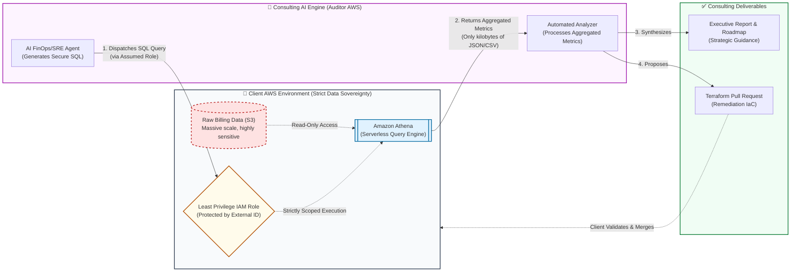

# FinOps & SRE Audit Engine: Architecture Overview

**Security First. Zero Data Extraction.**

Our integration architecture is explicitly designed to exceed the highest B2B enterprise security and compliance standards. The fundamental principle of our consulting engagements is that **your raw billing and operational data never leaves your AWS environment.**

We deploy a Least Privilege integration that empowers our automated AI analysis engine to securely query your data *in-place*. We extract only the high-level, aggregated metrics strictly required for strategic FinOps and SRE analysis.

## The Data Boundary

## Key Security Guarantees for CISOs & Security Engineering

1. **Zero Data Extraction:** Not a single megabyte of your raw Cost and Usage Report (CUR) or operational logs is transferred out of your perimeter. Our engine strictly orchestrates analysis using your internal compute resources (Amazon Athena).
2. **Confused Deputy Protection:** The IAM Role established for our integration is safeguarded by an `ExternalId`, cryptographically ensuring that only our designated, authenticated system can assume the role.
3. **Micro-Payload Return:** The only data traversing the cross-account boundary is the output of mathematical aggregations and statistical summaries (e.g., `[{"Unused_EC2_Wasted_Spend": 15000}]`).
4. **Actionable, Non-Destructive Delivery:** In addition to executive readouts, you receive ready-to-merge Infrastructure as Code (Terraform) Pull Requests. Your engineering teams retain absolute control and review authority over when and how infrastructure remediations are applied.
